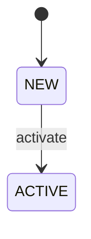

[ref: #bda-entities]

# Subagent prompt: entity catalog

**Task:** Extract and document the business entities, value objects,
aggregates, enums, and events for **one** service. Do not investigate
processes, rules, integrations, or risks; defer those topics.

## What to explore

Prioritize in this order:

1. **Domain models** — ORM classes, Pydantic/BaseModel, dataclasses, protobuf
   messages, migration schemas.
2. **Status/state enums** — lifecycle fields, state-machine transitions,
   guards, allowed transitions.
3. **Value objects** — small immutable types that carry business meaning
   (money, address, requisites).
4. **Domain events** — event classes, message topics, workflow signals,
   activity names.
5. **Business identifiers** — idempotency keys, external IDs, correlation IDs.

## Output structure

```markdown
# <Entity> — entity catalog

## Scope
...

## Existing memory summary
...

## Domain entities

### <EntityName>
- **Type:** aggregate / entity / value object / enum / event.
- **Definition:** one sentence in plain business language.
- **Key attributes:** business-meaningful fields only.
- **Lifecycle / state machine:** status values and allowed transitions.
- **Relationships:** owns / belongs to / references.
- **Invariants:** rules that must always hold.
- **Code anchors:** `file.py:line` (symbol).
- **Glossary terms:** terms to add or refine.

### <EntityName>
...

## Value objects

| Name | Definition | Attributes | Code anchor |
|---|---|---|---|
| ... | ... | ... | ... |

## Domain events

| Event | Trigger | Payload summary | Code anchor |
|---|---|---|---|
| ... | ... | ... | ... |

## State machines (Mermaid)



## Uncertainties and open questions
...
```

## Rules

- One entry per significant entity. Do not list every DB table.
- Status enums must include all values and allowed transitions.
- Every entity must have at least one code anchor.
- Do not duplicate technical stack details from `entities/<entity>`.
