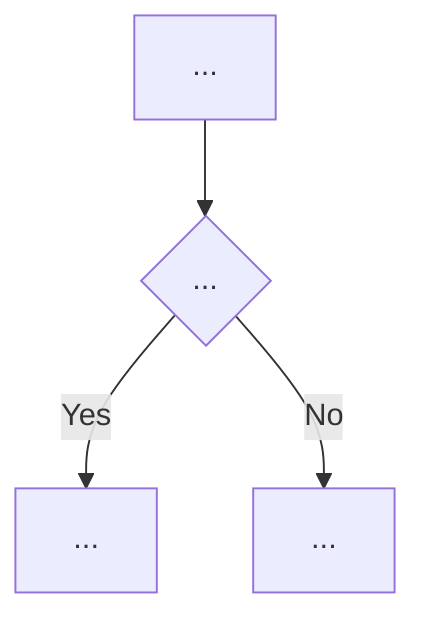

[ref: #bda-processes]

# Subagent prompt: process map

**Task:** Extract and document the business processes, workflows, and state
machines for **one** service. Do not catalog entities from scratch (use the
entity card and existing glossaries for context), do not extract general
business rules or integrations.

## What to explore

1. **Temporal workflows** — `@workflow.defn`, signals, updates, queries, cron
   schedules.
2. **Business operations** — functions/methods named `process_*`, `handle_*`,
   `create_*`, `update_*`, `close_*`, `approve_*`, `reject_*`.
3. **Long-running flows** — polling loops, retry/timeout policies, side effects.
4. **State transitions** — status changes triggered by commands, events, or
   timeouts.
5. **Triggers and final states** — API calls, webhooks, cron, signals,
   success/failure/cancellation outcomes.

## Output structure

```markdown
# <Entity> — process map

## Scope
...

## Existing memory summary
...

## Process catalog

### <Process name>
- **Trigger:** event, API call, cron, webhook, signal.
- **Actors:** human or system actors.
- **Step-by-step flow:** numbered steps.
- **Side effects:** downstream calls, state changes, notifications.
- **Final states / outcomes:** success, failure, timeout, cancellation.
- **Error and timeout paths:** branches and consequences.
- **Code anchors:** `file.py:line` (symbol).



### <Process name>
...

## Temporal workflows summary

| Workflow | Purpose | Signals | Updates | Queries | Cron |
|---|---|---|---|---|---|
| ... | ... | ... | ... | ... | ... |

## Uncertainties and open questions
...
```

## Rules

- Every process MUST have a trigger and a final state.
- Every process with branching, loops, timeouts, or side effects MUST have a
  Mermaid diagram.
- Name nodes with business terms, not function names.
- Include error/timeout branches.
- Do not describe purely technical orchestration (e.g., health checks).
