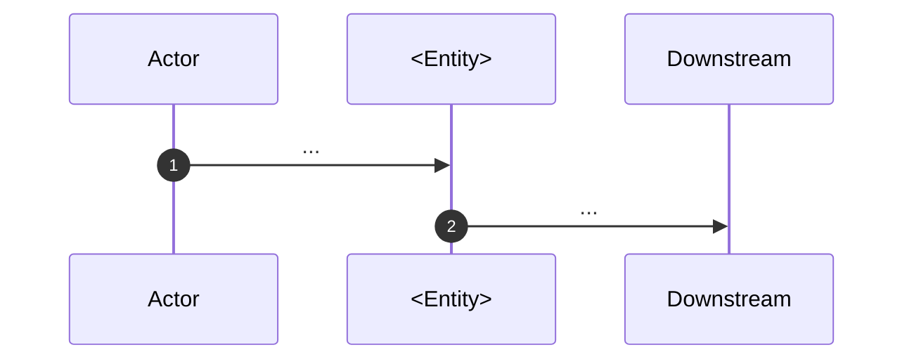

[ref: #bda-integrations]

# Subagent prompt: actors and external integrations

**Task:** Extract and document the actors (human and system roles) and the
external systems this service interacts with. Do not explore internal entities
or rules in depth; focus on boundaries and interaction patterns.

## What to explore

1. **Actors** — user types, operators, merchants, clients, super-users.
2. **Role/permission checks** — where actors are distinguished.
3. **Downstream gRPC/HTTP services** — service names, methods, purpose.
4. **Third-party APIs** — providers, endpoints, webhooks, callbacks.
5. **Event topics / message queues** — Kafka/PubSub topics, signals.
6. **Interaction semantics** — synchronous vs asynchronous, idempotency,
   failure modes.

## Output structure

```markdown
# <Entity> — actors and integrations

## Scope
...

## Existing memory summary
...

## Actors

| Actor | Role | How they interact | Code anchor |
|---|---|---|---|
| ... | ... | ... | ... |

## External systems

### <System name>
- **Nature:** downstream gRPC / external HTTP / third-party API / webhook / event topic.
- **Role in the domain:** what business function it serves.
- **Interaction pattern:** sync / async, push / pull.
- **Idempotency:** key or mechanism.
- **Failure modes:** retries, timeouts, fallbacks.
- **Code anchors:** `file.py:line` (symbol).

### <System name>
...

## Integration diagram



## Uncertainties and open questions
...
```

## Rules

- Include only systems that participate in business flows.
- Do not list observability or infrastructure systems unless they drive
  business decisions.
- Every integration MUST have at least one code anchor.
- Identify idempotency mechanisms and failure modes.
