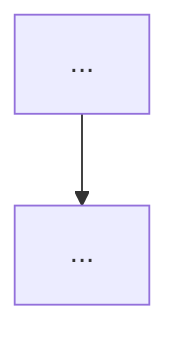

[ref: #bda-writer]

# Business-domain report synthesis

The root agent receives five detailed subagent reports:

1. `entities` — entity catalog.
2. `processes` — process map and workflows.
3. `rules` — business rules and invariants.
4. `integrations` — actors and external systems.
5. `risks` — risks, gaps, contradictions.

The root agent's job is to synthesize them into the final Serena memory output.
Do not explore the code again; rely on the subagent reports and resolve any
contradictions between them.

## Synthesis steps

1. Read all five subagent reports.
2. Compare factual claims across reports. If sources conflict, apply the
   hierarchy in `[ref: #serena-contradictions]`:
   - Newer memory overrides older memory.
   - `AGENTS.md` wins over session memory unless explicitly overridden.
   - Entity git metadata wins over `.serena` metadata for entity-specific facts.
3. Build a unified glossary delta:
   - Terms to add/refine/move in `project/glossary`.
   - Terms to add/refine/move in `logic/<entity>/glossary`.
4. Decide single vs split report using the criteria in `[ref: #bda-workflow]`.
5. Write the final memory/memories with refreshed YAML frontmatter.

## Single-report template

Use when the domain is compact (≤5 entities, ≤4 processes, ≤8 rules, ≤300
lines). Save as `logic/<entity>/business_domain_report`.

### Metadata header

Use the entity's own git repository for metadata (`repo: <entity>`).

```yaml
---
title: <Entity> business domain report
created_at: <UTC ISO 8601>
updated_at: <UTC ISO 8601>
repo: <entity>
branch: <branch>
commit: <7-char-short-hash>
committed_at: <UTC ISO 8601>
source: <entity-path>
---
```

### Section order

```markdown
# <Entity> business domain report

## Business purpose
1–2 paragraphs describing the business problem the service solves and the value
it delivers. Mention primary actor(s) and the core transaction or lifecycle.

## Key domain entities
- **EntityName** — one-line business definition.
- **EntityName** — one-line business definition.

## Key business processes
- **Process name** — trigger, actor, and one-line outcome.
- **Process name** — trigger, actor, and one-line outcome.

### <Process name>
**Trigger:** ...
**Actors:** ...
**Flow:**
1. ...
2. ...



**Code anchors:** ...

## Key business rules

### R1: <Rule statement>
- **Enforcement:** `path/file.py:line` (`symbol`)
- **Violation consequence:** ...
- **Related entities:** ...

## Key external integrations
- **System/Service** — role and interaction pattern.

## Risks and gaps
- `critical` / `warning` / `info` summary items with code anchors.
```

## Split-report structure

Use for complex domains. Save the executive summary as
`logic/<entity>/business_domain_report` and focused files as described below.

### Executive summary (`logic/<entity>/business_domain_report`)

```markdown
# <Entity> business domain report

## Business purpose
## Key domain entities (bullet list)
## Key business processes (bullet list)
## Key external integrations (bullet list)
## Risks and gaps (summary)

See `logic/<entity>/entities/*`, `logic/<entity>/processes/*`,
`logic/<entity>/rules/*`, `logic/<entity>/integrations/*`, and
`logic/<entity>/risks/*` for details.
```

### Entity files (`logic/<entity>/entities/<name>`)

```markdown
# <Entity> — <Business entity>

## Definition
## Type
## Key attributes
## Lifecycle / state machine
## Relationships
## Invariants
## Code anchors
## Glossary terms
```

### Process files (`logic/<entity>/processes/<name>`)

```markdown
# <Entity> — <Process name>

## Trigger
## Actors
## Step-by-step flow
## Mermaid diagram
## Events, signals, side effects
## Error and timeout paths
## Code anchors
```

### Rule files (`logic/<entity>/rules/<topic>`)

```markdown
# <Entity> — <Topic> rules

## R1: <Rule statement>
- **Enforcement:** `file.py:line` (`symbol`)
- **Violation consequence:** ...
- **Related entities:** ...

## R2: ...
```

### Integration files (`logic/<entity>/integrations/<topic>`)

```markdown
# <Entity> — <Integration> integration

## System role
## Interaction pattern
## Request/response semantics
## Failure modes
## Code anchors
```

### Risk files (`logic/<entity>/risks/<topic>`)

```markdown
# <Entity> — <Topic> risks

## CRITICAL: <Risk title>
- **Description:** ...
- **Impact:** ...
- **Code anchor:** ...

## WARNING: ...
## INFO: ...
```

## Memory split guidance

If the report is long, split it into focused memories:

- `logic/<entity>/business_domain_report` — executive summary only.
- `logic/<entity>/entities/<business_entity>` — one per significant entity.
- `logic/<entity>/processes/<process_name>` — one per process.
- `logic/<entity>/rules/<topic>` — grouped rules.
- `logic/<entity>/integrations/<topic>` — external actors/systems.
- `logic/<entity>/risks/<topic>` — risks and gaps.

Each split memory must include the same metadata header with fresh git context.

## Anti-patterns

### Copying the technical entity card
Bad:
```markdown
## Technology stack
- Python 3.11, Temporal SDK 1.18, PostgreSQL.
```
Good: stack belongs in `entities/<entity>`. The business report answers *what
business* the code does.

### Vague entity list
Bad:
```markdown
## Key domain entities
- Wallet
- Transfer
- Order
```
Good:
```markdown
## Key domain entities
- **Wallet** — deposit address with lifecycle states and types.
- **Transfer** — on-chain movement classified as deposit, withdrawal, top-up,
  or internal movement.
- **Order** — billing order created for deposits and top-ups.
```

### Process without trigger or final state
Bad:
```markdown
## Key business processes
- Deposit processing.
```
Good:
```markdown
## Key business processes
- **Deposit processing** — triggered by inbound transfer detection; ends with
  accepted clearing or rejected refund.
```

### Missing Mermaid for non-trivial flows
Bad: a multi-step process described only in prose.
Good: prose + `flowchart TD` showing branches, errors, and final states.

### Rules without enforcement location
Bad:
```markdown
## Key business rules
- Deposits below 0.01 USDT are ignored.
```
Good:
```markdown
## Key business rules
- **R1: Deposits below 0.01 USDT are ignored** — enforced in
  `app/workflow/trc_20.py:88` (`process_transfer`).
```

### Risks without anchors or severity
Bad:
```markdown
## Risks and gaps
- Hardcoded thresholds.
```
Good:
```markdown
## Risks and gaps
- `warning` Deposit threshold `0.01` USDT is hardcoded in
  `app/workflow/trc_20.py:91`.
```

### Including infrastructure plumbing
Bad:
```markdown
## Key external integrations
- Prometheus Pushgateway for resource metrics.
```
Good: include Prometheus only if a metric directly drives a business decision;
otherwise omit.

### Launching one subagent for everything
Bad: a single "analyze the business domain" subagent that returns a shallow,
overloaded report.
Good: five parallel specialized subagents, each reporting in depth on one
aspect, then root-agent synthesis.
