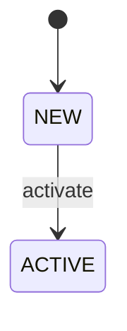
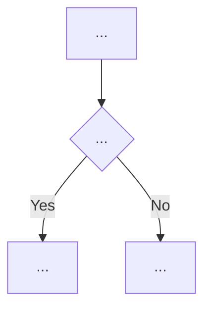
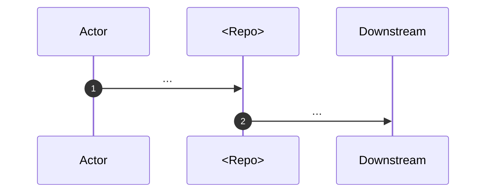

# Domain Analysis Subagent Prompts (repo-audit)

## Goal of the business-domain analysis

[ref: #ra-domain-goal]

Produce a structured, evidence-based description of the business layer encoded in the repository's source code. Extract the intentional model, not implementation details (DDD discipline: behavior over data; aggregates are defined by their invariants; domain events are business facts). The combined output of the domain extractors (this file) and the risks generator (`generators/domain.md`) MUST answer:

1. What business problem does this code solve?
2. What are the core business entities, value objects, and aggregates?
3. What business processes, state machines, and events exist?
4. What business rules and invariants are enforced?
5. Who are the actors and external systems?
6. What domain language is used, and how should the glossary be updated?
7. What can break the business — risks, gaps, contradictions?

Every domain subagent keeps these questions in mind but answers ONLY the slice assigned in its prompt; unanswered questions are flagged in `## Uncertainties and open questions`, not improvised.

## Subagent prompt: entity catalog

[ref: #ra-domain-entities]

**Task:** Extract and document the business entities, value objects,
aggregates, enums, and events for **one** service. Do not investigate
processes, rules, integrations, or risks; defer those topics.

### Required inputs (MUST read)

- `repos/<repo>/overview` (technical card).
- `project/glossary` and `repos/<repo>/glossary`.
- Existing `repos/<repo>/business.md` and split files related to entities (if present).

### What to explore

Prioritize in this order:

1. **Domain models** — ORM classes, Pydantic/BaseModel, dataclasses, protobuf messages, migration schemas.
2. **Status/state enums** — lifecycle fields, state-machine transitions, guards, allowed transitions.
3. **Value objects** — small immutable types that carry business meaning (money, address, requisites).
4. **Domain events** — event classes, message topics, workflow signals, activity names.
5. **Business identifiers** — idempotency keys, external IDs, correlation IDs.

### Output structure

```markdown
# <Repo> — entity catalog

## Existing memory summary
...

## Domain entities

### <EntityName>
- **Type:** aggregate / entity / value object / enum / event.
- **Definition:** one sentence in plain business language.
- **Key attributes:** business-meaningful fields only.
- **Lifecycle / state machine:** status values and allowed transitions.
- **Relationships:** owns / belongs to / references.
- **Invariants:** rules that must always hold.
- **Code anchors:** `file.py:line` (symbol).
- **Glossary terms:** terms to add or refine.

### <EntityName>
...

## Value objects

| Name | Definition | Attributes | Code anchor |
|---|---|---|---|
| ... | ... | ... | ... |

## Domain events

| Event | Trigger | Payload summary | Code anchor |
|---|---|---|---|
| ... | ... | ... | ... |

## State machines (Mermaid)



## Uncertainties and open questions
...
```

### Rules

- One entry per significant entity. Do not list every DB table.
- Status enums must include all values and allowed transitions.
- Every entity must have at least one code anchor.
- Do not duplicate technical stack details from `repos/<repo>/overview`.

## Subagent prompt: process map

[ref: #ra-domain-processes]

**Task:** Extract and document the business processes, workflows, and state
machines for **one** service. Do not catalog entities from scratch (use the
repo card and existing glossaries for context), do not extract general
business rules or integrations.

### Required inputs (MUST read)

- `repos/<repo>/overview` (technical card).
- `project/glossary` and `repos/<repo>/glossary`.
- Existing `repos/<repo>/business.md` and split files related to processes (if present).

### What to explore

1. **Temporal workflows** — `@workflow.defn`, signals, updates, queries, cron schedules.
2. **Business operations** — functions/methods named `process_*`, `handle_*`, `create_*`, `update_*`, `close_*`, `approve_*`, `reject_*`.
3. **Long-running flows** — polling loops, retry/timeout policies, side effects.
4. **State transitions** — status changes triggered by commands, events, or timeouts.
5. **Triggers and final states** — API calls, webhooks, cron, signals, success/failure/cancellation outcomes.

### Output structure

```markdown
# <Repo> — process map

## Existing memory summary
...

## Process catalog

### <Process name>
- **Trigger:** event, API call, cron, webhook, signal.
- **Actors:** human or system actors.
- **Step-by-step flow:** numbered steps.
- **Side effects:** downstream calls, state changes, notifications.
- **Final states / outcomes:** success, failure, timeout, cancellation.
- **Error and timeout paths:** branches and consequences.
- **Code anchors:** `file.py:line` (symbol).



### <Process name>
...

## Temporal workflows summary

| Workflow | Purpose | Signals | Updates | Queries | Cron |
|---|---|---|---|---|---|
| ... | ... | ... | ... | ... | ... |

## Uncertainties and open questions
...
```

### Rules

- Every process MUST have a trigger and a final state.
- Every process with branching, loops, timeouts, or side effects MUST have a
  Mermaid diagram.
- Name nodes with business terms, not function names.
- Include error/timeout branches.
- Do not describe purely technical orchestration (e.g., health checks).

## Subagent prompt: business rules and invariants

[ref: #ra-domain-rules]

**Task:** Extract and document the business rules, invariants, validation
logic, authorization checks, and calculation logic for **one** service. Do not
explore processes or integrations in depth; focus on the rules themselves.

### Required inputs (MUST read)

- `repos/<repo>/overview` (technical card).
- `project/glossary` and `repos/<repo>/glossary`.
- Existing `repos/<repo>/business.md` and split files related to rules (if present).

### What to explore

1. **Validation functions** — `validate_*`, `check_*`, `ensure_*`, `can_*`.
2. **Invariants** — conditions that must always hold for an entity or process.
3. **Authorization rules** — role/permission checks, actor-specific guards.
4. **Calculation logic** — pricing, fees, limits, thresholds, currency conversions.
5. **Configuration constants** — thresholds, currencies, blockchains, time windows that drive behavior.

### Output structure

```markdown
# <Repo> — business rules

## Existing memory summary
...

## Rule catalog

### R1: <Concise rule statement>
- **Type:** validation / invariant / authorization / calculation.
- **Enforcement:** `path/file.py:line` (`symbol_name`).
- **Violation consequence:** what happens when the rule is broken.
- **Related entities:** `EntityA`, `EntityB`.
- **Hardcoded values:** thresholds, currencies, time windows (if any).
- **Notes:** edge cases or inconsistencies.

### R2: ...

## Invariants summary

| Invariant | Entity/Process | Enforcement location | Code anchor |
|---|---|---|---|
| ... | ... | ... | ... |

## Authorization rules

| Rule | Actor | Condition | Code anchor |
|---|---|---|---|
| ... | ... | ... | ... |

## Calculation rules

| Rule | Formula / Logic | Code anchor |
|---|---|---|
| ... | ... | ... |

## Uncertainties and open questions
...
```

### Rules

- Every rule MUST have an enforcement location.
- State hardcoded values explicitly; do not hide them in prose.
- Distinguish validation (input rejected) from invariant (state illegal).
- Include edge cases and contradictions if the same rule appears in multiple
  places.

## Subagent prompt: actors and external integrations

[ref: #ra-domain-integrations]

**Task:** Extract and document the actors (human and system roles) and the
external systems this service interacts with. Do not explore internal entities
or rules in depth; focus on boundaries and interaction patterns.

### Required inputs (MUST read)

- `repos/<repo>/overview` (technical card).
- `project/glossary` and `repos/<repo>/glossary`.
- Existing `repos/<repo>/business.md` and split files related to integrations (if present).

### What to explore

1. **Actors** — user types, operators, merchants, clients, super-users.
2. **Role/permission checks** — where actors are distinguished.
3. **Downstream gRPC/HTTP services** — service names, methods, purpose.
4. **Third-party APIs** — providers, endpoints, webhooks, callbacks.
5. **Event topics / message queues** — Kafka/PubSub topics, signals.
6. **Interaction semantics** — synchronous vs asynchronous, idempotency, failure modes.

### Output structure

```markdown
# <Repo> — actors and integrations

## Existing memory summary
...

## Actors

| Actor | Role | How they interact | Code anchor |
|---|---|---|---|
| ... | ... | ... | ... |

## External systems

### <System name>
- **Nature:** downstream gRPC / external HTTP / third-party API / webhook / event topic.
- **Role in the domain:** what business function it serves.
- **Interaction pattern:** sync / async, push / pull.
- **Idempotency:** key or mechanism.
- **Failure modes:** retries, timeouts, fallbacks.
- **Code anchors:** `file.py:line` (symbol).

### <System name>
...

## Integration diagram



## Uncertainties and open questions
...
```

### Rules

- Include only systems that participate in business flows.
- Do not list observability or infrastructure systems unless they drive
  business decisions.
- Every integration MUST have at least one code anchor.
- Identify idempotency mechanisms and failure modes.
