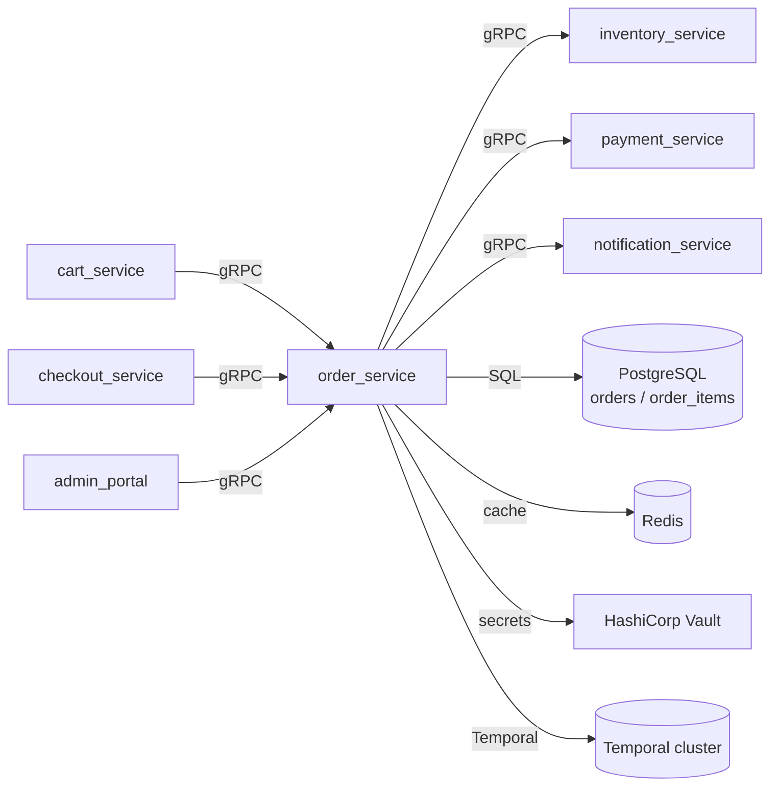

# Per-Service Dependency Card Template (repo-audit)

[ref: #ra-tpl-deps-card]

This file defines the exact layout and fill-instructions for
`repos/<repo>/dependencies.md`.

## YAML frontmatter

[ref: #ra-tpl-deps-card-frontmatter]

Use the current YAML frontmatter standard from `[ref: #serena-metadata]`;
collect the git tracking fields per the frontmatter-protocol tracking extension
(`[ref: #tracking-fields]`, `[ref: #tracking-git-commands]`).

```yaml
---
title: <repo> dependencies
created_at: YYYY-MM-DDTHH:MM:SSZ
updated_at: YYYY-MM-DDTHH:MM:SSZ
repo: <repo-name>
branch: <branch>
commit: <7-char-short-hash>
committed_at: YYYY-MM-DDTHH:MM:SSZ
source: <repo-name>/, repos/<repo>/overview.md, repos/<repo>/business.md
---
```

- `repo` is the logical name of the repo's source repository. It is not a
  display label; it identifies where the commit hash comes from. Per
  `[ref: #entity-repo-field]`, use the repo's own repo name for
  per-service cards and `generic` for project-wide memories.
- `source` lists the repo directory and the relevant memory files that fed
  this card. Do not duplicate the full frontmatter inside the body.

## Body structure

[ref: #ra-tpl-deps-card-body]

```markdown
# <repo> dependencies

**Identity:** `<directory>/` | `<type>` | `<one-sentence runtime role>`

## Provided interface

| Method / endpoint / workflow | Type | Description | Consumers |
|---|---|---|---|
| `<name>` | `<type>` | `<concise description>` | `<consumer list>` |

## Downstream dependencies

| Target | Direction | Methods / workflows used | Protocol | Purpose |
|---|---|---|---|---|
| `<target>` | `<repo> -> <direction>` | `<exact names>` | `<protocol>` | `<one-line purpose>` |

## Databases, external integrations, libraries, infrastructure

- **Databases:** `<list or "None" >`
- **External integrations:** `<list or "None" >`
- **Libraries:** `<list or "None" >`
- **Infrastructure:** `<list or "None" >`

## Notes

- `<observation 1>`
- `<known gap / TODO / contradiction>`

## Dependency diagram

```mermaid
...
```
```

## Section fill-instructions

[ref: #ra-tpl-deps-card-fill]

### Identity line

Format:

```markdown
**Identity:** `<directory>/` | `<type>` | `<one-sentence runtime role>`.
```

`<type>` is one of the canonical types from `repo-audit`:
`gRPC API service`, `REST API gateway`, `Temporal workflow worker`,
`Infrastructure / GitOps`, `library`.

### Provided interface

Columns:

| Column | Content |
|---|---|
| `Method / endpoint / workflow` | Exact name. For gRPC: `ServiceName.MethodName`. For REST: `METHOD /path`. For Temporal: workflow/activity/signal/query/update name. For libraries: module/class/function. For GitOps: HelmRelease/Kustomization name. |
| `Type` | The agent chooses the type based on the actual surface. Examples: `gRPC unary-unary`, `gRPC server-streaming`, `gRPC client-streaming`, `gRPC bidi`, `REST`, `REST endpoint`, `Temporal workflow`, `Temporal activity`, `Temporal signal`, `Temporal query`, `Temporal update`, `library module`, `library class`, `library function`, `GitOps HelmRelease`, `GitOps Kustomization`, `health endpoint`, `—`. |
| `Description` | One concise sentence explaining what it does. Use business context from `repos/<repo>/business`. |
| `Consumers` | Exact upstream consumers, or `—` for unused/unimplemented surfaces. For public APIs, consumer may be `End users`, `Operators`, `External partners`, etc. |

Rules:

- The table must be exhaustive: every public surface must appear.
- Include declared-but-unimplemented methods and mark them as such.
- Do not include private helpers, tests, or framework internals.

### Downstream dependencies

Columns:

| Column | Content |
|---|---|
| `Target` | Canonical name of the downstream system/service/library. Use names from `repos/` where possible. |
| `Direction` | `<repo> -> <direction>`. Examples: `my_service -> gRPC`, `my_service -> HTTP`, `my_service -> Temporal`, `my_service -> DB`, `my_service -> identity`, `my_service -> cache`, `my_service -> secrets`, `my_service -> library`. |
| `Methods / workflows used` | Exact RPC/workflow/signal/query names, table names, or endpoint paths. Use `—` for infrastructure-only connections. |
| `Protocol` | Concrete protocol: `gRPC over HTTP/2`, `HTTP/1.1 JSON`, `HTTPS JSON`, `Temporal gRPC`, `PostgreSQL wire / SQLAlchemy 2.0 async`, `Redis wire`, `Vault HTTP API`, `BigQuery API / Standard SQL`, `library`, etc. |
| `Purpose` | One-line reason for the dependency. |

Rules:

- List every downstream call. Do not omit "obvious" dependencies.
- For databases, include tables owned if the repo owns them.
- For shared libraries, list exact public symbols consumed when relevant.
- For infrastructure, describe the usage (e.g., `HashiCorp Vault — secret injection`).

### Databases, external integrations, libraries, infrastructure

Use a bullet list with bold category labels:

```markdown
- **Databases:** PostgreSQL — `table_a`, `table_b`, `table_c`
- **External integrations:** Zitadel HTTP API v2, SendGrid v3 Mail Send API
- **Libraries:** `classic-grpc[async]`, SQLAlchemy 2.0, Alembic
- **Infrastructure:** HashiCorp Vault, Temporal cluster, Sentry
```

If a category is not applicable, write `None` with a brief explanation (e.g.,
"No owned database; stateless worker").

### Notes

Bulleted observations specific to this repo's dependency graph:

- Architectural takeaways.
- Deprecated or alias dependencies.
- Ghost/unused dependencies.
- Hardcoded assumptions.
- Known gaps or TODOs.
- Contradictions discovered during synthesis.

### Dependency diagram

Mandatory. The root agent draws the diagram from the three dependency
extractor reports (interface, downstream, infra) during synthesis; there is no
diagram subagent. Include every upstream consumer and every downstream target
from the tables. Use `graph LR`, `graph TB`, or `flowchart` as appropriate.

Rules:

- One node per repo/system.
- Label edges with protocol or purpose.
- Use subgraphs only when they improve readability.
- Do not omit nodes because the diagram would be large. If the diagram becomes
  unwieldy, use a high-level diagram plus a note that details are in the tables.
- Validate Mermaid syntax before writing.

## Generic example

[ref: #ra-tpl-deps-card-example]

```markdown
# order_service dependencies

**Identity:** `order-service/` | gRPC API service | Manages order lifecycle and fulfillment orchestration.

## Provided interface

| Method / endpoint / workflow | Type | Description | Consumers |
|---|---|---|---|
| `OrderService.CreateOrder` | gRPC unary-unary | Creates a new order and validates inventory | `cart_service`, `checkout_service` |
| `OrderService.GetOrder` | gRPC unary-unary | Returns order details by id | `cart_service`, `admin_portal` |
| `OrderService.CancelOrder` | gRPC unary-unary | Cancels an order and triggers refund flow | `admin_portal` |
| `processFulfillment` | Temporal workflow | Long-running fulfillment orchestration | Started by `OrderService.CreateOrder` |
| `refundOrder` | Temporal workflow | Refund workflow for canceled orders | Started by `OrderService.CancelOrder` |

## Downstream dependencies

| Target | Direction | Methods / workflows used | Protocol | Purpose |
|---|---|---|---|---|
| `inventory_service` | `order_service -> gRPC` | `InventoryService.Reserve`, `InventoryService.Release` | gRPC over HTTP/2 | Reserve and release inventory |
| `payment_service` | `order_service -> gRPC` | `PaymentService.Charge`, `PaymentService.Refund` | gRPC over HTTP/2 | Payment processing |
| `notification_service` | `order_service -> gRPC` | `NotificationService.SendOrderUpdate` | gRPC over HTTP/2 | Customer notifications |
| PostgreSQL | `order_service -> DB` | `orders`, `order_items`, `fulfillment_events` | PostgreSQL wire / SQLAlchemy 2.0 | Persistence |
| Redis | `order_service -> cache` | Order status cache | Redis wire | Idempotency and caching |
| HashiCorp Vault | `order_service -> secrets` | Database credentials | Vault HTTP API | Secret injection |
| Temporal cluster | `order_service -> orchestration` | `processFulfillment`, `refundOrder` | Temporal gRPC | Workflow execution |

## Databases, external integrations, libraries, infrastructure

- **Databases:** PostgreSQL — `orders`, `order_items`, `fulfillment_events`
- **External integrations:** None
- **Libraries:** `classic-grpc[async]`, SQLAlchemy 2.0, Alembic
- **Infrastructure:** HashiCorp Vault, Temporal cluster, Redis, Sentry

## Notes

- `OrderService.UpdateOrder` is declared in the proto but not implemented.
- Fulfillment workflow is started synchronously from `CreateOrder`.
- Refund path does not re-reserve inventory; this is tracked as a known gap.

## Dependency diagram


```
